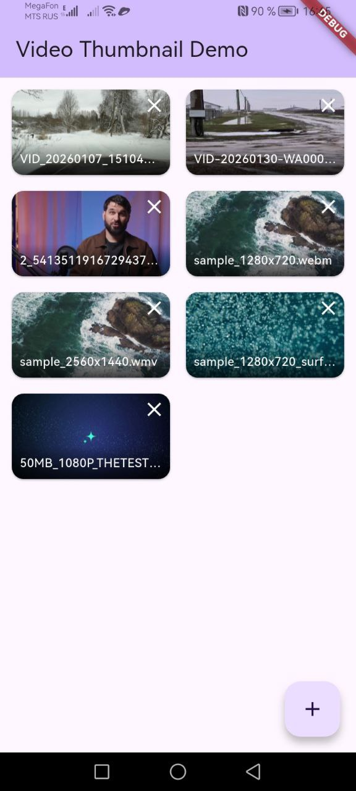

# smart_video_thumbnail Example

This example demonstrates how to use the `smart_video_thumbnail` plugin to extract and display video thumbnails in a Flutter application.

## Features Demonstrated

- 📹 **Video Selection** - Pick videos from device storage using file_picker
- 🖼️ **Thumbnail Generation** - Extract thumbnails at specific time positions
- 📱 **Grid Layout** - Display thumbnails in a responsive grid with 16:9 aspect ratio
- 🗑️ **Video Management** - Add and remove videos from the list
- 🎨 **Material Design** - Clean UI with Material Design 3 components
- 🏗️ **MVI Architecture** - Model-View-Intent pattern for state management

## Screenshot



## Getting Started

### Prerequisites

1. **Android Device/Emulator** running Android 8.0+ (API 26+)
2. **GitHub Token** with `read:packages` permission

### Setup

1. Add GitHub credentials to `~/.gradle/gradle.properties`:

```properties
gpr.user=YOUR_GITHUB_USERNAME
gpr.key=YOUR_GITHUB_TOKEN
```

2. Install dependencies:

```bash
flutter pub get
```

3. Run the app:

```bash
flutter run
```

## How It Works

### Architecture

The example uses MVI (Model-View-Intent) architecture:

```
┌─────────────────────────────────┐
│         UI (main.dart)          │
│  - Displays video grid          │
│  - Handles user interactions    │
└────────────┬────────────────────┘
             │ Intents
┌────────────▼────────────────────┐
│  Controller (app_controller.dart)│
│  - Processes intents            │
│  - Updates state                │
└────────────┬────────────────────┘
             │ State Updates
┌────────────▼────────────────────┐
│    State (app_state.dart)       │
│  - List of videos               │
│  - Loading status               │
└─────────────────────────────────┘
```

### Key Components

#### 1. Video Service (`services/video_service.dart`)

Handles video thumbnail extraction:

```dart
Future<Uint8List?> getThumbnail(String path) async {
  return await SmartVideoThumbnail.getThumbnail(
    videoPath: path,
    width: 320,
    height: 180,
    timeMs: 1000,
  );
}
```

#### 2. App Controller (`controller/app_controller.dart`)

Manages application state and business logic:

```dart
void handleIntent(AppIntent intent) {
  if (intent is AddVideoIntent) {
    _addVideo();
  } else if (intent is RemoveVideoIntent) {
    _removeVideo(intent.videoId);
  }
}
```

#### 3. Video Grid Item (`widgets/video_grid_item.dart`)

Displays individual video thumbnails with delete button.

## Usage Example

### Basic Thumbnail Extraction

```dart
import 'package:smart_video_thumbnail/smart_video_thumbnail.dart';

final thumbnail = await SmartVideoThumbnail.getThumbnail(
  videoPath: '/path/to/video.mp4',
  width: 320,
  height: 180,
  timeMs: 1000, // Extract at 1 second
);

if (thumbnail != null) {
  // Display using Image.memory or convert to ui.Image
  Image.memory(thumbnail);
}
```

### With Custom Strategy

```dart
// Extract first frame (fastest)
final thumbnail = await SmartVideoThumbnail.getThumbnail(
  videoPath: videoPath,
  strategy: ThumbnailStrategy.firstFrame,
);

// Extract keyframe (for AVI/FLV)
final thumbnail = await SmartVideoThumbnail.getThumbnail(
  videoPath: videoPath,
  strategy: ThumbnailStrategy.keyframe,
);
```

## Code Structure

```
example/lib/
├── main.dart                    # App entry point
├── models/
│   ├── app_state.dart          # Application state
│   └── video_item.dart         # Video data model
├── intent/
│   └── app_intent.dart         # User intents
├── controller/
│   └── app_controller.dart     # State management
├── services/
│   └── video_service.dart      # Video operations
└── widgets/
    └── video_grid_item.dart    # Grid item widget
```

## Permissions

The app requires storage permissions to access video files. These are handled automatically by the `file_picker` package.

## Troubleshooting

### Build Errors

If you encounter build errors:

1. Clean the project:

```bash
flutter clean
cd android && ./gradlew clean && cd ..
flutter pub get
```

2. Verify GitHub credentials in `~/.gradle/gradle.properties`

3. Check Android SDK and NDK are installed

### Runtime Errors

Enable logging to debug:

```bash
adb logcat | grep -E "SmartVideoThumbnail|SmartFfmpegBridge"
```

## Performance Tips

1. **Cache Thumbnails** - Store generated thumbnails to avoid re-extraction
2. **Background Processing** - Use `compute()` for large video lists
3. **Optimize Size** - Use smaller dimensions (320x180) for grid views
4. **First Frame Strategy** - Use `ThumbnailStrategy.firstFrame` for fastest extraction

## Learn More

- [Plugin Documentation](../README.md)
- [API Reference](../README.md#-api-reference)
- [Native Library](https://github.com/Daronec/smart-ffmpeg-android)

## License

This example is part of the smart_video_thumbnail plugin and is licensed under the MIT License.
